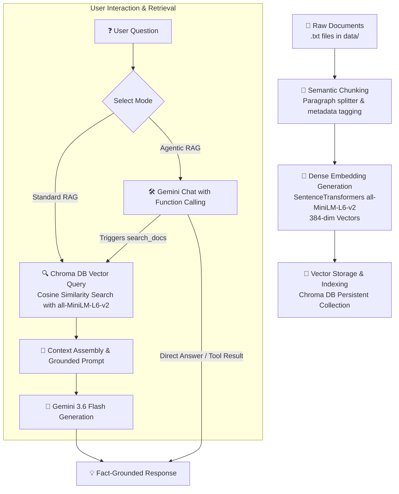

# (RAG PIPELINE) System using Gemini, Chroma DB, and without LangChain

A lightweight, high-performance, production-ready **Retrieval-Augmented Generation (RAG)** system built strictly using **Google Gemini 3.6 Flash**, **Chroma DB**, **SentenceTransformers (`all-MiniLM-L6-v2`) Embedding Model**, and **Python** — built entirely **without LangChain** or third-party orchestration frameworks.

---

## 📌 Brief Overview

Many modern RAG applications rely heavily on framework abstractions like LangChain or LlamaIndex, which can introduce hidden complexity, latency overhead, and debugging friction. 

This project demonstrates how to build a **fully functional, robust RAG Pipeline from scratch** using native Python code, high-density vector embeddings generated by the **SentenceTransformers (`all-MiniLM-L6-v2`)** embedding model, direct vector similarity search via **Chroma DB**, and direct LLM generation/tool calling using **Google Gemini**.

### 🌟 Key Features
- **Zero Framework Dependency**: No LangChain / LlamaIndex overhead. Pure, transparent Python logic.
- **Custom Paragraph Chunking**: Intelligently splits document text while retaining section metadata.
- **Dense Vector Embeddings**: Uses the **SentenceTransformers (`all-MiniLM-L6-v2`)** model to convert text chunks into 384-dimensional dense semantic vectors.
- **Persistent Vector Store**: Uses **Chroma DB** to store and query vector embeddings persistently on disk.
- **Grounded LLM Generation**: Uses `gemini-3.6-flash` with strict system prompt grounding to eliminate hallucinations.
- **Context Refusal Fallback**: Explicitly returns *"I don't have enough context or information to answer this question"* for out-of-domain queries.
- **Native Agentic Tool Calling**: Uses Gemini's native function calling (`search_docs`) to allow the model to dynamically choose when to query internal documents versus answering direct general knowledge questions.
- **Automated Evaluation Suite**: Benchmark script (`evaluate.py`) to verify accuracy, keyword coverage, and refusal performance.

---

## 🔄 End-to-End Process Workflow



### Detailed Workflow Steps:

1. **Step 1: Document Ingestion & Storage (`data/`)**
   - Text documents (HR Policy, Engineering Standards, Onboarding Guide, Product Knowledge Base, Security Policy) are stored in the `data/` folder.

2. **Step 2: Semantic Paragraph Chunking (`ingest.py`)**
   - Documents are split by paragraph boundaries (`\n\n`), ignoring short header lines and formatting noise. Each chunk is tagged with its origin metadata (e.g., `{"source": "HR Policy"}`).

3. **Step 3: Embedding Generation & Vector Indexing (`SentenceTransformers` + `Chroma DB`)**
   - Each paragraph chunk is transformed into a 384-dimensional dense semantic vector representation using the **`all-MiniLM-L6-v2`** model from **SentenceTransformers**. The document chunks, embeddings, IDs, and metadata are indexed into a persistent ChromaDB collection stored locally at `./chroma_db`.

4. **Step 4: Vector Similarity Search & Context Retrieval (`query.py`)**
   - User questions are embedded into the same vector space using **`all-MiniLM-L6-v2`** embeddings and queried against ChromaDB using cosine similarity to retrieve the top $K$ ($N=3$) most relevant context chunks.

5. **Step 5: Grounded LLM Response Generation (`gemini-3.6-flash`)**
   - The retrieved context chunks and user question are injected into a strict system prompt instructing Gemini to answer **only** based on the provided context, refusing to hallucinate if the answer is missing.

6. **Step 6: Native Agentic Function Tooling (`search_docs`)**
   - In Agentic Mode, Gemini is provided with a native function tool `search_docs`. Gemini dynamically decides whether it needs to call `search_docs` for internal company information or answer directly for general math/conversational queries.

---

## 📁 Repository Structure

```text
RAG PIPELINE BASIC/
│
├── data/                         # Folder containing knowledge base text files
│   ├── company_hr_policy.txt
│   ├── engineering_standards.txt
│   ├── onboarding_guide.txt
│   ├── product_knowledge_base.txt
│   └── security_policy.txt
│
├── chroma_db/                    # Persistent vector database directory (stores embeddings)
│
├── .env.example                  # Environment variables template
├── .env                          # Local environment variables file (contains GEMINI_API_KEY)
├── .gitignore                    # Git ignore rules for secrets and venv
│
├── ingest.py                     # Document loader & ChromaDB ingestion pipeline
├── query.py                      # Core retrieval engine, Standard RAG & Agentic RAG logic
├── app.py                        # Interactive CLI query application
├── evaluate.py                   # Automated benchmark evaluation suite
├── requirements.txt              # Project dependencies list
└── RAG_pipeline_from_scratch.ipynb  # Initial step-by-step notebook prototype
```

---

## ⚙️ Installation & Quickstart

### 1. Clone the Repository
```bash
git clone https://github.com/akhiranandan-04/Simple-RAG-Pipeline-.git
cd Simple-RAG-Pipeline-
```

### 2. Create & Activate Virtual Environment
```bash
# Windows
python -m venv venv
.\venv\Scripts\Activate.ps1

# Linux / macOS
python3 -m venv venv
source venv/bin/activate
```

### 3. Install Dependencies
```bash
pip install -r requirements.txt
```

### 4. Configure API Keys
Copy `.env.example` to `.env` and set your Google Gemini API key:
```bash
cp .env.example .env
```
Edit `.env`:
```env
GEMINI_API_KEY=your_gemini_api_key_here
```

---

## 🚀 Running the System

### 1. Ingest Documents into Vector Store
```bash
python ingest.py
```

### 2. Run Interactive CLI App
```bash
python app.py
```
You can also run direct queries:
```bash
# Standard Grounded RAG
python app.py -q "What is the work from home policy?"

# Agentic RAG Mode
python app.py -a -q "How many sick leave days do I get per year?"
```

### 3. Run Automated Evaluation Suite
```bash
python evaluate.py
```

---

## 📊 Tech Stack

| Component | Technology | Description |
|---|---|---|
| **LLM Engine** | Google Gemini (`gemini-3.6-flash`) | Generation & reasoning model |
| **Embedding Model** | **SentenceTransformers (`all-MiniLM-L6-v2`)** | 384-dimensional dense semantic text embeddings |
| **Vector Database** | Chroma DB (Persistent Client) | Local persistent vector storage & similarity search |
| **Orchestration** | Pure Python | Built from scratch without LangChain or LlamaIndex |
| **Language** | Python 3.10+ | Primary language |

---

## 📄 License
Distributed under the MIT License.
